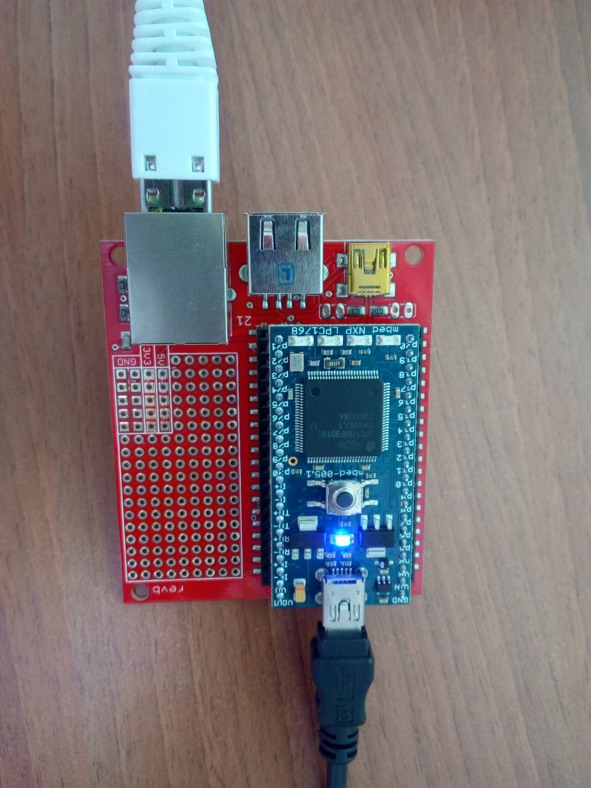
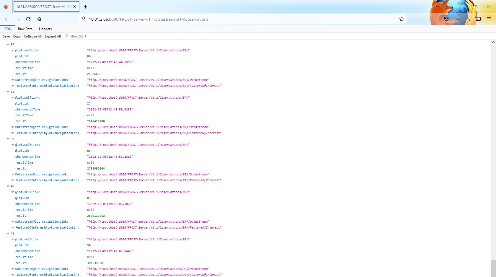

# mbed_sensorthings

A very simple example on how to send data from an IoT device to a FROST server.  

## Getting started
This tiny project is based on the tutorial "[ARM mbed LPC1768: Connect to SensorUp SensorThings](https://developers.sensorup.com/tutorials/mbed/)". The original tutorial permits to send the temperature to a SensorUp SensorThings Playground server from a mbed application board. The source code of the tutorial was modified to replace the temperature sensor by a generator of random numbers, the sending of data to a FROST server hosted on the IoT Lab infrastructure, the support to use the [Keil Studio Cloud](https://studio.keil.arm.com/) compiler. This compiler is free and available online, without the need to install it locally on a computer. It is a good alternative to Keil uVision5 compiler, which requires a local installation and a license to get all the features.

## Modifications of the source code
The source code of this project can be modified by uploading the project on [Keil Studio Cloud](https://studio.keil.arm.com/). Keil Studio Cloud is using Mercurial as distributed version control: so, do all the modifications only through Keil Studio Cloud.

## Upload the build file on a mbed LPC1768 board
Follow the following steps to upload the build file provided [here](https://gitlab.distantaccess.com/ad4gd/mbed_sensorthings/-/blob/main/DIST/mbed_sensorthings.LPC1768.bin) on a mbed board:
1.  Download the built file on your computer.
1.  Connect the mbed board on an USB port of your computer.
1.  Copy and paste the `mbed_sensorthings.LPC1768.bin` file from your computer to the mbed board. The mbed board is seen as an USB stick.

## Testing
First of all, the FROST server should have already a structure representing a location where the IoT device is deployed. A basic example is given by Fraunhofer and is available [here](https://gitlab.distantaccess.com/ad4gd/mbed_sensorthings/-/blob/main/doc/demoEntities.json). Our IoT device, namely the mbed board, is sending the data to the URI `/FROST-Server/v1.1/Datastreams(1)/Observations` defined in the above JSON file. This JSON file should be sent to the FROST server through the following command:  
`curl -X POST -H "Content-Type: application/json" -d @demoEntities.json http://x.x.x.x:8090/FROST-Server/v1.1/Things -vv` (Replace `x.x.x.x` by the IP address or the domain name of the FROST server instance.)  
Then, you can go with your preferred Web browser at the URL `x.x.x.x:8090/FROST-Server/v1.1/Datastreams(1)/Observations` to see the data sent by the mbed board. The results should be similar to the following illustration:  

## Authors and acknowledgment
Cédric Crettaz (IoT Lab), based on the work done by [Robin Luo](https://os.mbed.com/users/robinlk/).
